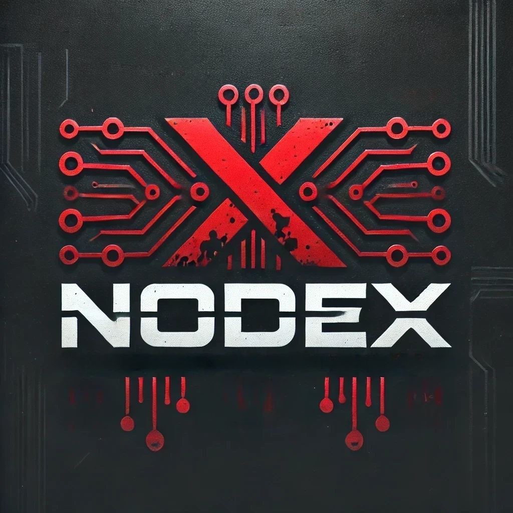

# NodeX  


## Dynamic GUI Framework with PySide6  

**NodeX** is a dynamic GUI framework built using PySide6, enabling modular, scalable, and intuitive desktop applications. It supports advanced workflows for AI agents and user interactions, making it a powerful tool for developers and AI enthusiasts alike.


---

## 🌟 **Future Plans**

- Reworking the GUI for a more intuitive, user-friendly interface.
- Completing the **Grid-Node Workflow-Management System**.
- Integrating **NodeX Workflow Management** with AI Chat & Agents to control various tasks and operations seamlessly.

---

# 📚 Overview  

## **DynamicPySide6 Framework**  

A robust and modular GUI framework offering:  
- **Dynamic Page Management**: Automatic module detection and loading.  
- **Custom Themes**: Flexible light/dark modes.  
- **Advanced Logging**: Comprehensive error handling and performance tracking.  
- **Responsive Design**: Cross-platform compatibility, including desktops and select mobile devices (e.g., Android).  

## **AI-Chat + Agent System**

An extensible system designed to facilitate AI-powered tasks, such as:  
- Interactive conversations.  
- Code generation and analysis.  
- Documentation and workflow management.  

---

## 🛠 **Key Features**

### Dynamic GUI Framework
- **Modular Design**: Components like navigation, headers, and footers are reusable and adaptable.  
- **Customizable Themes**: Easily toggle between light and dark modes.  
- **Responsive Layout**: Designed to work across multiple devices and screen sizes.  

### AI-Powered Agents  
- **Multi-Agent Support**:  
  - **Standard Chat Agent**: Handles general queries and assistance.  
  - **Developer Agent**: Specially built for coding tasks, including analysis, generation, and debugging.  

- **Code Block Extraction**: Extract and analyze code snippets from input sources like text and files.  
- **File Management**: Manage files within the workspace directly from the GUI.  
- **Prompt Viewer**: Easily manage and edit system prompts via an integrated markdown viewer.

---

### 🖥️ **Enhanced GUI Features**
- **Fast-Whisper Tab**:  
  - Quickly access the Fast-Whisper tool using the `§` key (default).  
  - The keybind remains disabled while the tab is active.  

- **Integrated Terminal**:  
  - Access a built-in terminal directly within the GUI.  

- **Codeblock Tab**:  
  - All codeblocks are displayed in a dedicated tab, separate from the chat interface, for a cleaner and more organized workspace.  

- **Agent Controls**:  
  - Toggle agents such as the **Developer Agent** or **Crew Agent** on or off.  
  - Easily switch between different workflow modes.  

---

### ⚙️ **Workflows**

#### Developer Workflows  
- **Troubleshoot**: Debug and fix issues effectively.  
- **Improve**: Enhance existing code for better performance and readability.  
- **Develop**: Create and implement new features.  
- **Document**: Generate clear and concise documentation.

#### Crew Workflows  
- **Design**: Plan and create system architecture.  
- **Implementation**: Develop and integrate new features.  
- **Review**: Conduct code and architecture reviews.  
- **Deployment**: Ensure seamless system integration and deployment.

---

### 🤖 **Model Selection**

Choose from a wide range of LLM models, including:

#### **Anthropic Models**
- Haiku  
- Sonnet 35  
- Sonnet  
- Opus  

#### **OpenAI Models**
- GPT-3.5  
- GPT-3.5 Instruct  
- GPT-4  
- GPT-4o  
- GPT-4o Mini  

#### **Groq Models**
- Gemma 7b  
- Gemma2 9b  
- Llama 3.1 405b Reasoning  
- Llama 3.1 70b Versatile  
- Llama 3.1 8b Instant  
- Llama Guard 3 8b  
- Llama3 708 8192  
- Llama3 88 8192  
- Llama3 708 8192 Tool Use Preview  
- Llama3 88 8192 Tool Use Preview  
- Mixtral 8x7B 32768  

#### **Other Models**
- Ollama  
- Google  
- LM Studio  
- OpenRouter


---

## 🔧 **Installation**

### Prerequisites  
Ensure you have Python 3.8+ and `pip` installed.  

### Setup  
1. Clone the repository:  
   ```bash
   git clone https://github.com/rewnozom/NodeX.git
   cd NodeX
   ```

2. Install dependencies:  
   ```bash
   python setup.py install
   ```

3. Activate the virtual environment:  

   - **Linux/Mac**:  
     ```bash
     source env/bin/activate
     python dynamic_main_ref.py
     ```

   - **Windows**:  
     ```powershell
     .\env\Scripts\Activate.ps1
     python dynamic_main_ref.py
     ```

4. For development installations:  
   ```bash
   python setup.py develop
   ```

---

## 📋 **Testing**  

Run the testing framework:  

```bash
python -m unittest discover
```

---

## 🛠 **Development Workflow**

### Modular Installation  
Install requirements from `./Config/setup/` based on your needs:  

```bash
pip install -r Config/setup/<file>.txt
```

- **`ai.txt`**: Dependencies for AI-related features.  
- **`gui.txt`**: GUI-related libraries.  
- **`web.txt`**: Web and API tools.  
- **`dev.txt`**: Development tools.  

### Running the Project  

```bash
python dynamic_main_ref.py
```

---


---

## 🤝 **Contributions**

We welcome contributions! Feel free to submit pull requests or open issues.  

1. Fork the repository.  
2. Create a feature branch.  
   ```bash
   git checkout -b feature-branch
   ```
3. Commit your changes.  
   ```bash
   git commit -m "Add new feature"
   ```
4. Push to the branch and open a pull request.  

---
---

# 🔮 **Coming Soon: NodeX Development Plan & Checklist**

NodeX is expanding with more advanced features and integrations. Here's a sneak peek at what's in development:

## ✅ **Implemented Base Nodes**
- **Input_Node**  
- **Output_Node**  
- **SystemPrompt_Node**  
- **LLM_Node**

---

## 🛠️ **Core Agent Nodes** *(Priority 1)*  
- [ ] **TaskManager_Node**  
- [ ] **DecisionMaker_Node** *(Workflow Control)*  
- [ ] **Analyst_Node**  
- [ ] **CodeReviewer_Node**  
- [ ] **CodeIntegration_Node**  
- [ ] **Developer_Node**

---

## 🔄 **Flow Control Nodes** *(Priority 2)*  
- [ ] **IF_Node** *(Conditional Branching)*  
- [ ] **Switch_Node** *(Multi-State)*  
- [ ] **Splitter_Node** *(Workflow Division)*  
- [ ] **Merger_Node** *(Data Combination)*  
- [ ] **UserInteraction_Node** *(Pause/Resume)*  
- [ ] **Loop_Node** *(Iteration Control)*  

---

## 📊 **Data Manipulation Nodes** *(Priority 3)*  
- [ ] **DataType_Node** *(Type Conversion)*  
- [ ] **List_Node**  
- [ ] **Dict_Node**  
- [ ] **JSON_Node**  
- [ ] **String_Node** *(Manipulation)*  
- [ ] **Math_Node** *(Operations)*  

---

## 💾 **Memory & Storage Nodes** *(Priority 4)*  
- [ ] **Memory_Node** *(State Storage)*  
- [ ] **Cache_Node**  
- [ ] **Embedding_Node**  
- [ ] **Variable_Node**  
- [ ] **LocalStorage_Node**

---

## 🔌 **Tool Integration Nodes** *(Priority 5)*  
- [ ] **ToolSearch_Node**  
- [ ] **ToolCall_Node**  
- [ ] **ToolCreate_Node**  
- [ ] **APIConnection_Node**  
- [ ] **WebhookTrigger_Node**

---

# 📋 **Development Tasks**

### 🌀 **Phase 1: Core Framework**
- ✅ Basic Node System  
- ✅ Async Execution  
- ✅ Data Streaming  
- [ ] Error Handling  
- [ ] State Management  

### 🤖 **Phase 2: Agent Integration**
- [ ] Agent Communication Protocol  
- [ ] Task Orchestration  
- [ ] Decision-Making Logic  
- [ ] Agent Memory System  

### 🔄 **Phase 3: Flow Control**
- [ ] Conditional Execution  
- [ ] Parallel Processing  
- [ ] Queue Management  
- [ ] Event System  

### 📊 **Phase 4: Data & Tools**
- [ ] Data Validation  
- [ ] Type Safety  
- [ ] Tool Registration  
- [ ] API Integration  

### 🎨 **Phase 5: UI/UX**
- [ ] Node Customization  
- [ ] Visual Debugging  
- [ ] Performance Monitoring  
- [ ] Workflow Templates  

---

## 🚀 **Future Considerations**
- Finetune local llm for this specific framework
- Plugin system  
- Visual scripting for custom nodes  
- Cloud deployment
---

# 🌌 **NodeX - AI Workflow Management System**

NodeX is a visual programming environment designed for creating and managing AI workflows. It offers a node-based interface for connecting AI components and managing their interactions.

## Key Features  
- Visual node-based programming interface  
- Real-time workflow execution  
- Support for LM Studio and other LLM providers  
- Asynchronous operation handling  
- Caching and optimization  
- Custom node creation support  

---

## ⚙️ **Requirements**
- Python 3.10 - 3.11
- LM Studio (for local LLM support)  - Download our finetuned model for best performence
- Compatible with Windows, Linux, and macOS  

---

## 🛠️ **LM Studio Configuration**
1. Start LM Studio and ensure it's running on port 1234 (default).  
2. Load your preferred model in LM Studio.  
3. NodeX will automatically connect to LM Studio during runtime.

---

## 🧩 **Creating Workflows**
1. Use the **node editor** interface to add nodes.  
2. Connect nodes by dragging between pins.  
3. Configure node parameters as needed.  
4. Click **Run** to execute and save the workflow.  

---


## 🔧 **Troubleshooting**
1. **Environment Issues**  
   - Ensure Python 3.10+ is installed.  
   - Run `setup.py` to create a fresh environment.  
   - Check the activation script path.  

2. **LM Studio Connection**  
   - Verify LM Studio is running.  
   - Check port configuration.  
   - Ensure a model is loaded.  

3. **Node Errors**  
   - Check node connections.  
   - Verify input/output types match.  
   - Check execution order.  


----
## 📜 **License**
Feel free to customize & use this further or let me know if you'd like specific design or content changes!


