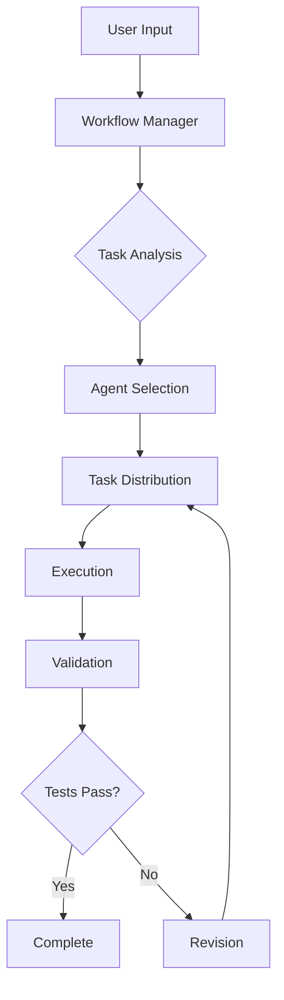
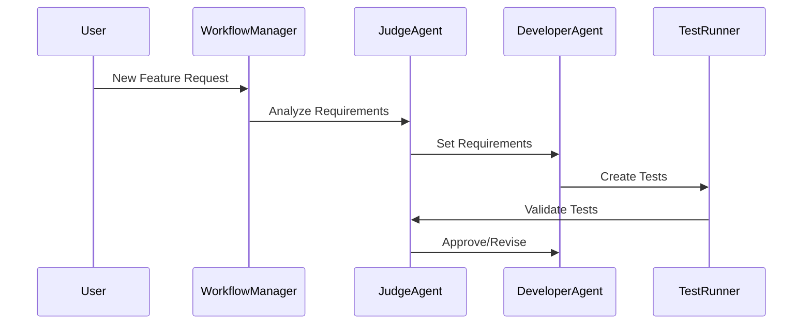

# AI Agent Framework Development Plan

## Phase 1: Core Infrastructure Enhancement

### 1.1 LLM Model Layer Restructuring
- Implement modular model interface system
- Focus on LM Studio integration while maintaining extensibility
- Create model registry and factory pattern for easy model addition
- Implement model configuration validation and error handling

### 1.2 Base Agent Architecture
- Create enhanced BaseAgent abstract class with improved lifecycle hooks
- Implement robust error handling and logging system
- Add state management and monitoring capabilities
- Create agent registry and dynamic loading system

### 1.3 Agent Communication Protocol
- Design standardized message format for inter-agent communication
- Implement event system for agent coordination
- Create message validation and error handling
- Add debugging and monitoring capabilities

## Phase 2: Agent Implementation

### 2.1 Core Agents Enhancement
- Implement new JudgeAgent for quality control and validation
  ```
  JudgeAgent Responsibilities:
  - Code quality validation
  - Test coverage requirements
  - Performance benchmarking
  - Security assessment
  - Dependency analysis
  ```
- Enhance existing agents:
  - ChatAgent: Improve conversation management
  - DeveloperAgent: Add TDD capabilities
  - ArchitectAgent: Enhanced system design validation
  - ReviewerAgent: Improved code analysis

### 2.2 Dynamic Workflow System
- Create WorkflowManager class
- Implement workflow state machine
- Add dynamic task generation and assignment
- Create workflow validation system

### 2.3 Testing Framework
- Implement TestRunner subsystem
- Add support for multiple test types:
  - Unit tests
  - Integration tests
  - Performance tests
  - Security tests
- Create test result analysis and reporting

## Phase 3: Plugin System

### 3.1 Agent Plugin Architecture
- Create plugin registry system
- Implement hot-loading of agents from plugins directory
- Add plugin dependency management
- Create plugin configuration validation

### 3.2 Custom Agent Development Kit
- Create agent development templates
- Implement agent validation tools
- Add documentation generation
- Create example agents

## Phase 4: Integration & Orchestration

### 4.1 CrewAI Integration
- Enhance CrewAI integration
- Implement custom role system
- Add dynamic team formation
- Create task distribution system

### 4.2 Workflow Orchestration
- Implement workflow orchestrator
- Add parallel task execution
- Create workflow monitoring system
- Implement workflow recovery mechanisms

## Project Structure
```
ai_agent/
├── core/
│   ├── models/
│   │   ├── base_model.py
│   │   ├── lm_studio.py
│   │   └── model_registry.py
│   ├── agents/
│   │   ├── base_agent.py
│   │   └── agent_registry.py
│   └── workflow/
│       ├── workflow_manager.py
│       └── state_machine.py
├── agents/
│   ├── judge_agent.py
│   ├── developer_agent.py
│   ├── architect_agent.py
│   └── reviewer_agent.py
├── plugins/
│   └── agent_plugins/
├── testing/
│   ├── test_runner.py
│   └── test_validators.py
├── orchestration/
│   ├── crew_manager.py
│   └── task_distributor.py
└── utils/
    ├── logging.py
    └── monitoring.py
```

## Implementation Flow

1. **Setup Phase**
   - Create new project structure
   - Implement core interfaces
   - Setup testing framework

2. **Core Development**
   - Implement BaseAgent enhancements
   - Create model layer
   - Develop plugin system

3. **Agent Implementation**
   - Develop JudgeAgent
   - Enhance existing agents
   - Implement workflow system

4. **Integration**
   - Integrate CrewAI
   - Implement orchestration
   - Add monitoring system

5. **Testing & Validation**
   - Implement test runners
   - Add validation systems
   - Create example workflows

## Key Features

### Dynamic Workflow System


### Agent Communication


## Key Improvements

1. **Modularity**
   - Plugin-based architecture
   - Loose coupling between components
   - Clear separation of concerns

2. **Scalability**
   - Dynamic agent loading
   - Parallel task execution
   - Resource management

3. **Maintainability**
   - Comprehensive logging
   - Clear error handling
   - Extensive documentation

4. **Testing**
   - Automated test generation
   - Continuous validation
   - Performance monitoring

5. **User Experience**
   - Clear workflow visibility
   - Progress monitoring
   - Error reporting

## Next Steps

1. Begin with core infrastructure
2. Implement base agent system
3. Develop JudgeAgent
4. Create workflow manager
5. Integrate testing framework
6. Add plugin system
7. Enhance with CrewAI
8. Implement monitoring