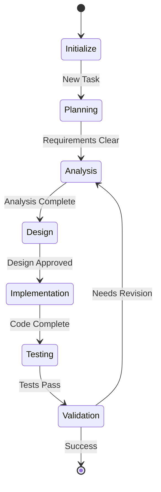

# Enhanced AI Agent Framework Development Plan

## Phase 1: Core LLM Infrastructure
1. Model Registry System
   - Modular provider system
   - Versioning support
   - Rate limiting and token tracking
   - Automatic model fallback

2. Base Agent System
   - Asynchronous event system
   - State machine for workflow
   - Dynamic agent loading
   - Test harness integration

## Phase 2: Agent Implementation

### Workflow System


### Core Agents
1. **JudgeAgent**
   - Quality metrics validation
   - Test coverage requirements
   - Performance benchmarking
   - Security assessment
   - Resource utilization monitoring

2. **ArchitectAgent** 
   - System design
   - Component integration
   - API design
   - Performance optimization

3. **DeveloperAgent**
   - TDD implementation
   - Code generation
   - Documentation
   - Unit testing

4. **ReviewerAgent**
   - Code review
   - Best practices validation
   - Security review
   - Performance analysis

## Phase 3: Testing Framework 

1. Test Runner Core
   - Unit test execution
   - Integration test framework
   - E2E test support
   - Performance testing
   - Test coverage analysis

2. Validation Components
   - Code quality metrics
   - Performance benchmarks
   - Security scanning
   - Resource monitoring

## Phase 4: Plugin Architecture

1. Dynamic Loading
   ```python
   class PluginManager:
       def load_plugins(self, plugin_dir: str):
           for plugin_file in Path(plugin_dir).glob("*.py"):
               spec = importlib.util.spec_from_file_location(
                   plugin_file.stem, plugin_file)
               module = importlib.util.module_from_spec(spec)
               spec.loader.exec_module(module)
               
               if hasattr(module, "register_plugin"):
                   module.register_plugin(self.registry)
   ```

2. Plugin Interface
   ```python
   class AgentPlugin(Protocol):
       async def initialize(self) -> None: ...
       async def process(self, context: Context) -> Result: ...
       async def cleanup(self) -> None: ...
   ```

## Phase 5: Implementation Strategy

1. Core Services
   ```python
   class AgentFramework:
       def __init__(self):
           self.model_registry = ModelRegistry()
           self.plugin_manager = PluginManager() 
           self.test_runner = TestRunner()
           self.workflow = WorkflowManager()

       async def execute_task(self, task: Task) -> Result:
           workflow = self.workflow.create(task)
           await workflow.execute()
           return workflow.result
   ```

2. Workflow Implementation
   ```python
   class WorkflowManager:
       def create_workflow(self, task: Task) -> Workflow:
           agents = self.select_agents(task)
           steps = self.generate_steps(task)
           return Workflow(agents, steps)

       async def execute_workflow(self, workflow: Workflow):
           for step in workflow.steps:
               result = await step.execute()
               if not result.success:
                   await self.handle_failure(step, result)
   ```

## Project Structure
```
ai_agent/
├── core/
│   ├── models/
│   │   ├── registry.py
│   │   └── providers/
│   ├── agents/
│   │   ├── base.py
│   │   └── registry.py
│   └── workflow/
│       ├── manager.py
│       └── steps.py
├── agents/
│   ├── judge.py
│   ├── architect.py
│   ├── developer.py
│   └── reviewer.py
├── testing/
│   ├── runner.py
│   └── validators.py
├── plugins/
│   └── loader.py
└── utils/
    ├── logging.py
    └── monitoring.py
```

## Implementation Flow

1. **Initialization**
   - Load configuration
   - Initialize model registry
   - Start plugin system

2. **Task Processing**
   - Validate input
   - Create workflow
   - Assign agents
   - Execute steps

3. **Testing & Validation**
   - Run test suites
   - Validate results
   - Generate reports

4. **Feedback Loop**
   - Collect metrics
   - Adjust workflow
   - Optimize resource usage

## Next Steps

1. Start with base agent infrastructure
2. Implement test framework
3. Add core agents
4. Integrate workflow system
5. Add plugin support